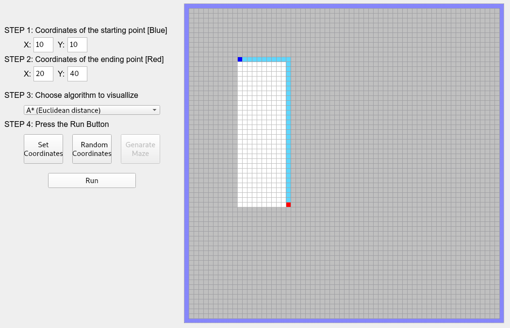
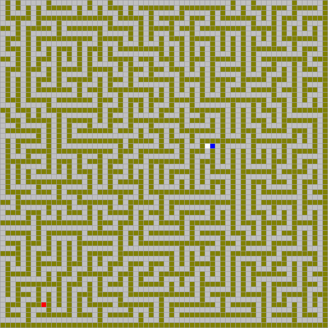
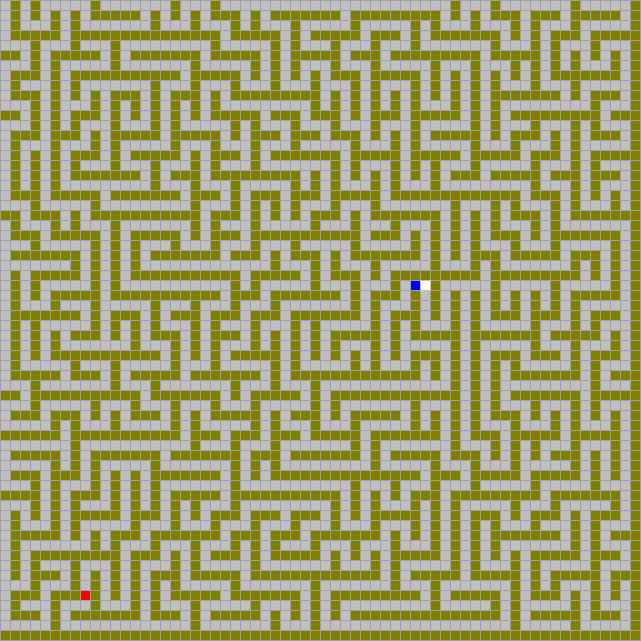
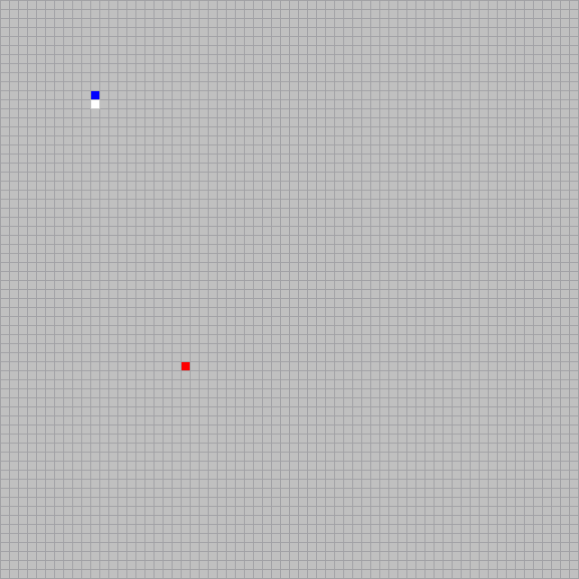
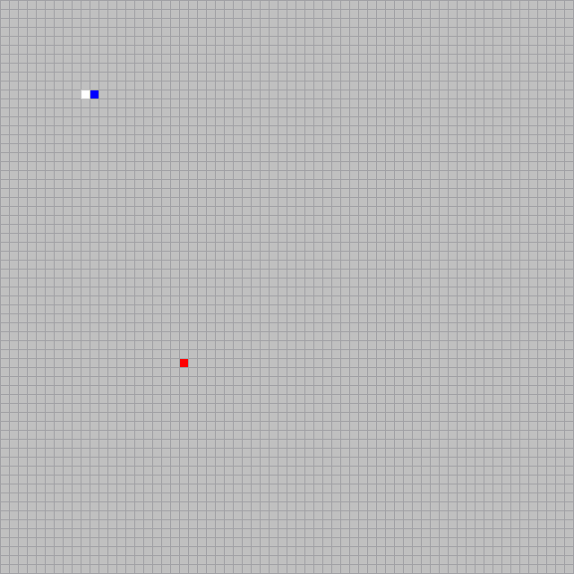
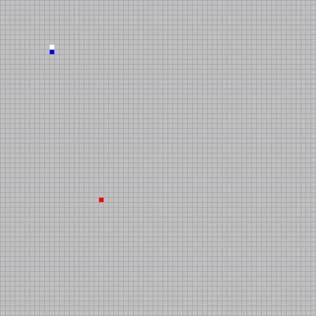

# Visualization of Path Finding Algorithms

Application for the visualization of [Path Finding Algorithms](https://en.wikipedia.org/wiki/Pathfinding#Algorithms),
implemented using Python and PyQt5. The following algorithms are implemented:

- [Breadth First Search](https://en.wikipedia.org/wiki/Breadth-first_search)
- [Depth First Search](https://en.wikipedia.org/wiki/Depth-first_search)
- [Dijkstra's Algorithm](https://en.wikipedia.org/wiki/Dijkstra%27s_algorithm)
- [A* Algorithm](https://en.wikipedia.org/wiki/A*_search_algorithm), using the heuristics:
    - [Euclidean distance](https://en.wikipedia.org/wiki/Euclidean_distance)
    - [Manhattan distance](https://en.wikipedia.org/wiki/Taxicab_geometry)

The pathfinding algorithms are visualized on a 64×64 grid, as shown below. The coordinates of the start and ending
points can be manually specified, or randomly selected. The generation of random mazes is supported (the mazes are
generated with the use of the [Depth First Search](https://en.wikipedia.org/wiki/Depth-first_search) algorithm).

|             Application screenshot             |                Maze generation                |
|:----------------------------------------------:|:---------------------------------------------:|
|  |  |

## Examples in maze

|                A* (Euclidean distance)                |                A* (Manhattan distance)                |    Breadth First Search&nbsp;&nbsp;&nbsp;   | &nbsp;&nbsp;Depth First Search&nbsp;&nbsp;&nbsp; |
|:-----------------------------------------------------:|:-----------------------------------------------------:|:-------------------------------------------:|:-----------------------------------------:|
|  |  |  |  |

## Examples in empty grid

|                A* (Euclidean distance)                |                A* (Manhattan distance)                |    Breadth First Search&nbsp;&nbsp;&nbsp;   | &nbsp;&nbsp;Depth First Search&nbsp;&nbsp;&nbsp; |
|:-----------------------------------------------------:|:-----------------------------------------------------:|:-------------------------------------------:|:-----------------------------------------:|
|       |       |       |       |
